<div align="center">

<!-- Wave header -->


<!-- Typing animation -->


<br/>


</div>

<br/>

<!-- Animated neural SVG -->


<br/>

## ◈ What is NeuralFlix?

NeuralFlix is a full-stack **semantic recommendation engine** for movies and TV series. Instead of relying on collaborative filtering or naive keyword matching, it converts every piece of content into a high-dimensional vector using a transformer model — then finds your nearest neighbors in that embedding space via FAISS.

> 💡 Tell it you love *Inception*. It understands **why** — the psychological tension, the layered reality, the non-linear structure — and surfaces everything that shares that DNA.

<br/>

## ◈ Pipeline

<!-- Animated pipeline SVG -->


<br/>

## ◈ Dataset

```
Content indexed: 1,048 total entries
├── 🎬  623  Movies
│    ├── Popular, Top Rated, Now Playing, Trending
│    └── Genre discovery across 13 categories  (vote_count ≥ 1,000)
│
└── 📺  425  TV Series
     ├── Popular, Top Rated, Trending
     └── Genre discovery across 15 categories  (vote_count ≥ 500)
```

Each entry stores: `title · year · genres · cast[8] · directors · creators · plot · keywords[10] · rating · tmdb_id`

> Genres are **doubled** in the embedding text to give them higher semantic weight. Directors and TV show creators are treated symmetrically, enabling coherent cross-media recommendations.

<br/>

## ◈ Tech Stack

<div align="center">

| Layer | Technology | Purpose |
|:---|:---|:---|
| **Embeddings** | `all-mpnet-base-v2` | 768-dim semantic text vectors |
| **Vector Index** | `FAISS IndexFlatIP` | Exact cosine similarity search |
| **Data Source** | TMDB API v3 | Metadata, cast, keywords, ratings |
| **Backend** | FastAPI + Uvicorn | REST API, CORS, async handling |
| **Frontend** | Next.js 14 + Tailwind | Dark glass UI |
| **Animation** | Framer Motion | Neural loader, card reveals |
| **Icons** | Lucide React | Minimal icon system |
| **Backend Hosting** | AWS EC2 | Python/FastAPI server |
| **Frontend Hosting** | AWS Amplify | Next.js deployment & CI/CD |

</div>

<br/>

## ◈ Deployment

<div align="center">

```
                    ┌─────────────────────────────────┐
                    │         AWS Architecture         │
                    └─────────────────────────────────┘

   ┌──────────────────────┐          ┌──────────────────────┐
   │     AWS Amplify      │          │      AWS EC2         │
   │   (Frontend · CDN)   │  ──────▶ │  (Backend · Python)  │
   │                      │          │                      │
   │  Next.js 16 · React  │  POST    │  FastAPI · Uvicorn   │
   │  Tailwind · Framer   │ /recommend│  FAISS · SentenceT.  │
   │                      │          │  Port 8000           │
   └──────────────────────┘          └──────────────────────┘
            │                                  │
            │ Static Assets                    │ media.faiss
            │ media_titles.json                │ media_database.json
            │                                  │ embeddings.npy
            ▼                                  ▼
       CloudFront CDN                    EC2 Instance Store
```

</div>

### Infrastructure Notes

- **Backend (AWS EC2):** FastAPI runs on port `8000` with Uvicorn. The FAISS index, embeddings matrix, and media database are loaded into memory at startup for sub-millisecond search latency.
- **Frontend (AWS Amplify):** Continuous deployment from the repository. Next.js API routes act as a proxy layer, fetching recommendations from EC2 and enriching results with live TMDB poster images.

<br/>

## ◈ Getting Started

### 1 — Install dependencies

```bash
pip install faiss-cpu sentence-transformers fastapi uvicorn numpy pandas tqdm requests
```

### 2 — Build the database & FAISS index

```bash
# Open the notebook and run cells in order:
jupyter notebook movie_recommender.ipynb

# Cell 1 → Test the TMDB API key
# Cell 2 → Build media_database.json        (~20 min first run)
# Cell 3 → Encode vectors + write media.faiss  (~5 min)
```

After Cell 3 you'll have:

```
media_database.json   ←  ~1,048 entries of metadata
media.faiss           ←  binary FAISS index
embeddings.npy        ←  pre-computed numpy matrix
media_titles.json     ←  title list for autocomplete
```

### 3 — Start the backend

```bash
cd backend && uvicorn main:app --reload --port 8000
```

### 4 — Start the frontend

```bash
cd frontend && npm install && npm run dev
```

Open **http://localhost:3000** 

<br/>

## ◈ API Endpoints

| Method | Endpoint | Payload |
|:---|:---|:---|
| `POST` | `/recommend` | `{ "title": "Inception", "top_k": 8 }` |
| `GET` | `/api/titles` | `→ ["Inception", "The Dark Knight", ...]` |

<br/>

## ◈ Embedding Strategy

```python
def content_to_text(item: dict) -> str:
    parts = [
        " ".join(item.get('genres', [])),     # genres doubled
        " ".join(item.get('genres', [])),     # for extra semantic weight
        " ".join(item.get('directors', [])),
        " ".join(item.get('creators', [])),   # TV show-runners
        " ".join(item.get('cast', [])[:5]),
        item.get('plot', ''),
        " ".join(item.get('keywords', [])),
    ]
    return " ".join(p for p in parts if p).strip()
```

After ranking by cosine similarity, a second pass generates human-readable match reasons:

```
✓ Genre match: Action, Thriller
✓ Same director: Christopher Nolan
✓ Shared actor(s): Tom Hardy
✓ Similar themes: psychological, nonlinear narrative
```

<br/>

## ◈ Project Structure

```
neuralflix/
├── README.md
├── movie_recommender.ipynb      # Data pipeline (DB + FAISS)
├── media_database.json          # Generated: metadata
├── media.faiss                  # Generated: FAISS index
├── embeddings.npy               # Generated: numpy matrix
├── media_titles.json            # Generated: autocomplete list
│
├── assets/                      # README visuals
│   ├── neural.svg               # Animated neural engine diagram
│   └── pipeline.svg             # Animated pipeline diagram
│
├── backend/
│   └── main.py                  # FastAPI backend + FAISS search
│
└── frontend/
    ├── components/
    │   ├── HeroSection.jsx      # Animated landing + search
    │   ├── SearchBar.jsx        # Autocomplete + keyboard nav
    │   ├── RecommendationGrid.jsx
    │   ├── MovieCard.jsx        # Hover-reveal poster card
    │   ├── NeuralLoader.jsx     # Animated FAISS progress
    │   └── TerminalPanel.jsx    # Nerd-mode live log panel
    └── public/
        ├── file.svg
        ├── globe.svg
        ├── next.svg
        ├── vercel.svg
        └── window.svg
```

<br/>

## ◈ Configuration

| Variable | Location | Default | Description |
|:---|:---|:---|:---|
| `TMDB_API_KEY` | `movie_recommender.ipynb` | — | Your TMDB v3 key |
| `top_k` | `POST /recommend` | `8` | Results returned |
| `device` | `main.py` | `'cpu'` | Set `'cuda'` for GPU |
| `batch_size` | Cell 3 | `64` | Encoding batch size |
| `vote_count.gte` | Cell 2 | `1000` / `500` TV | Quality filter |

<br/>

## ◈ Credits

- [TMDB](https://www.themoviedb.org/) — content metadata API
- [sentence-transformers](https://www.sbert.net/) — `all-mpnet-base-v2`
- [FAISS](https://github.com/facebookresearch/faiss) — Facebook AI Similarity Search
- [FastAPI](https://fastapi.tiangolo.com/) — async Python web framework
- [Framer Motion](https://www.framer.com/motion/) — React animation library

<br/>

---

<!-- Made with Love section -->
<div align="center">


<br/>


<br/>

## ◈ Authors

<table>
  <tr>
    <td align="center">
      <a href="https://github.com/Arghyadevs">
        
      </a>
      <br/><br/>
      <sub><b>Backend · Frontend · AWS Infrastructure</b></sub><br/>
      <sub>FastAPI · Next.js · EC2 · Amplify · DevOps</sub>
    </td>
    <td align="center">
      <a href="https://github.com/SoumyaJanaJGEC2001">
        
      </a>
      <br/><br/>
      <sub><b>ML Pipeline · Vector Search Engine</b></sub><br/>
      <sub>FAISS · SentenceTransformers · Embeddings · TMDB Data</sub>
    </td>
  </tr>
</table>

<br/>

<!-- Contribution snake or streak animation alternative -->


<br/>


&nbsp;

&nbsp;

&nbsp;


</div>

<br/>

<!-- Wave footer -->


<div align="center">
<sub>Built for people who are serious about what they watch next. &nbsp;|&nbsp; <b>Arghyadevs</b> &amp; <b>Lucifer</b> · 2025</sub>
</div>
